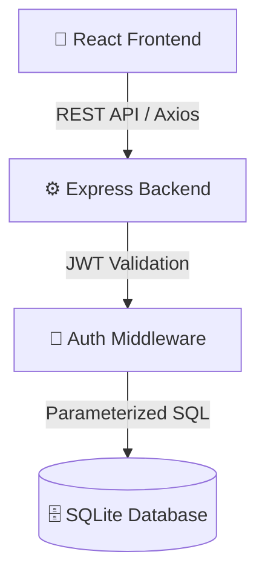
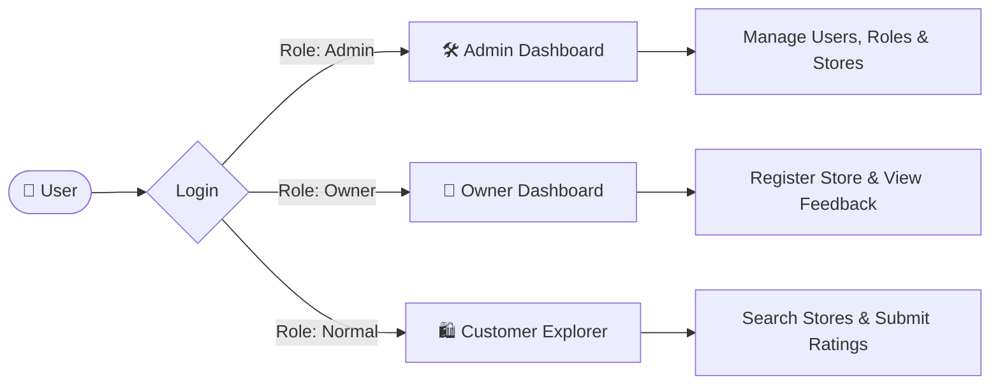
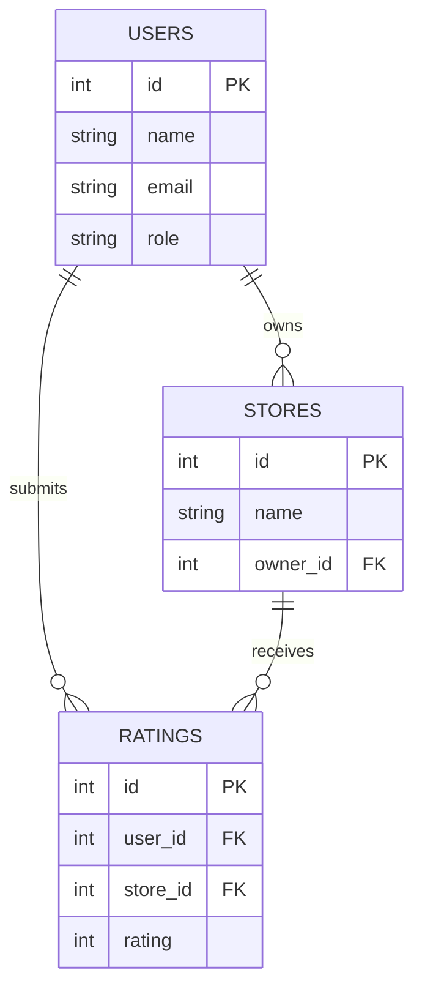
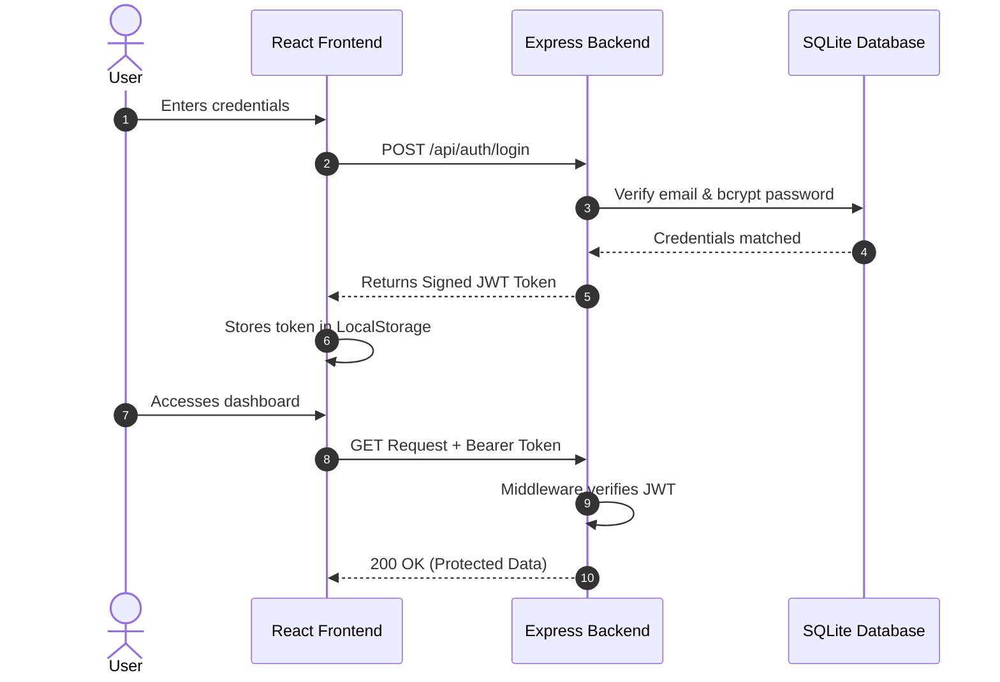

<div align="center">

#  StoreHub: Enterprise Rating Management System

**A fully custom, ground-up full-stack platform for managing, exploring, and rating stores.**

[](#)
[](#)
[](#)
[](#)

*Beautifully designed. Securely engineered. Entirely homegrown.*

</div>

---

##  About The Project

StoreHub is an original full-stack web application designed to connect customers with local stores through a rich, interactive rating and review system. I built this project to solve the complexities of multi-role user management while delivering an uncompromising, premium user experience.

It features a fully custom UI without relying on heavy external CSS frameworks, a robust RESTful API, and a deeply optimized SQLite database.

## ✨ Key Features

### 🎭 Three Distinct Experiences (RBAC)
- **System Administrator:** Total control over the platform. Monitor system health, manage all users, and oversee store registrations.
- **Store Owner:** A dedicated portal to register stores, track average ratings, and read customer feedback in real-time.
- **Customer:** A seamless discovery interface to search for stores, submit detailed reviews, and update profiles.

### 🎨 Premium "Aurora Glass" UI
I designed the frontend to feel immersive and modern:
- **Custom Glassmorphism:** Semi-transparent, frosted-glass panels (`backdrop-filter`) over a deep black background.
- **Aurora Mesh Animation:** A dynamic, CSS-only ambient radial gradient animation that breathes life into the application.
- **Smart Time-Based Greetings:** The dashboard natively recognizes the user's local time and updates its greetings dynamically.
- **Zero CSS Libraries:** 100% custom-written, highly optimized CSS-in-JS and inline styles.

### 🔒 Security & Data Integrity
- **Stateless Authentication:** Secure JWT-based login system with role payload encoding.
- **Password Protection:** Deep bcrypt hashing with automatic salt generation.
- **SQL Injection Defense:** Strict use of parameterized queries and prepared statements across the entire backend.
- **Input Sanitization:** Multi-layered request validation using `express-validator`.

## 🛠️ Technology Stack

**Frontend:**
* ⚛️ React.js (v18)
* 📡 Axios (for API communication)
* 💅 Custom CSS3 Animations & Glassmorphism

**Backend:**
* 🟢 Node.js & Express.js
* 🔑 JWT (JSON Web Tokens)
* 🛡️ bcryptjs
* 📋 express-validator

**Database:**
* 🗄️ SQLite3 (Relational mapping, foreign key constraints, cascading deletes)

---

## 📐 System Architecture & Flow

### High-Level Architecture


### Role-Based Access Flow


---

## � Getting Started

Want to run StoreHub locally? It's incredibly easy to set up.

### Prerequisites
- Node.js (v18 or higher)
- npm (Node Package Manager)

### Installation & Setup

**1. 📥 Clone the project**
```bash
git clone <your-repo-url>
cd store-rating-system
```

**2. ⚙️ Environment Configuration**
```bash
# Backend environment (.env)
PORT=3001
JWT_SECRET=your_secure_jwt_secret_key_here
SUPABASE_URL=your_supabase_url
SUPABASE_ANON_KEY=your_supabase_key
```

**3. 🗄️ Database Initialization**
```bash
# Automated database setup with sample data
cd backend
node init-db.js
```

**4. 🚀 Application Launch**
```bash
# Terminal 1 - Backend Server
cd backend
npm run dev

# Terminal 2 - Frontend Application
cd frontend
npm start
```

### 🎯 Access Credentials

| Role | Email | Password | Capabilities |
|------|-------|----------|-------------|
| **System Admin** | admin@system.com | Admin123! | Full system control |
| **Store Owner** | john@techstore.com | Admin123! | Store management |
| **Store Owner** | sarah@fashionboutique.com | Admin123! | Store management |
| **Customer** | alice@customer.com | User123! | Rating & reviews |
| **Customer** | bob@customer.com | User123! | Rating & reviews |

## 🔧 API Documentation

### Authentication Endpoints
```http
POST   /api/auth/register     # User registration with validation
POST   /api/auth/login        # JWT token authentication
PUT    /api/auth/password     # Secure password updates
```

### Administrative Operations
```http
GET    /api/admin/dashboard       # System analytics & metrics
GET    /api/admin/users          # User management with filters
GET    /api/admin/stores         # Store administration
GET    /api/admin/store-owners   # Store owner directory
POST   /api/admin/users          # User creation with role assignment
POST   /api/admin/stores         # Store registration
```

### Store Operations
```http
GET    /api/stores               # Store directory with search
POST   /api/stores/:id/rating    # Rating submission/updates
GET    /api/stores/:id/reviews   # Store review analytics
```

### Store Owner Portal
```http
GET    /api/store-owner/dashboard    # Performance analytics
POST   /api/store-owner/store        # Store profile management
```

## 🗄️ Database Architecture

### Entity Relationship Diagram


### Optimized Schema Design
```sql
-- Users table with role-based constraints
CREATE TABLE users (
    id INTEGER PRIMARY KEY AUTOINCREMENT,
    name VARCHAR(60) CHECK (length(name) BETWEEN 20 AND 60),
    email VARCHAR(255) UNIQUE NOT NULL,
    password VARCHAR(255) NOT NULL,
    address VARCHAR(400),
    role VARCHAR(20) DEFAULT 'normal' CHECK (role IN ('admin', 'normal', 'store_owner')),
    created_at DATETIME DEFAULT CURRENT_TIMESTAMP
);

-- Stores with owner relationships
CREATE TABLE stores (
    id INTEGER PRIMARY KEY AUTOINCREMENT,
    name VARCHAR(60) CHECK (length(name) BETWEEN 20 AND 60),
    email VARCHAR(255) UNIQUE NOT NULL,
    address VARCHAR(400),
    owner_id INTEGER REFERENCES users(id) ON DELETE CASCADE,
    created_at DATETIME DEFAULT CURRENT_TIMESTAMP
);

-- Ratings with constraints and uniqueness
CREATE TABLE ratings (
    id INTEGER PRIMARY KEY AUTOINCREMENT,
    user_id INTEGER REFERENCES users(id) ON DELETE CASCADE,
    store_id INTEGER REFERENCES stores(id) ON DELETE CASCADE,
    rating INTEGER CHECK (rating BETWEEN 1 AND 5),
    review TEXT,
    created_at DATETIME DEFAULT CURRENT_TIMESTAMP,
    updated_at DATETIME DEFAULT CURRENT_TIMESTAMP,
    UNIQUE(user_id, store_id)
);
```

### Performance Optimizations
- **Strategic Indexing**: Optimized indexes on frequently queried columns
- **Foreign Key Constraints**: Referential integrity with cascade operations
- **Data Validation**: Database-level constraints for data consistency
- **Normalized Design**: Third normal form compliance for optimal performance

## 🛡️ Security Implementation

### Authentication & Authorization
- **JWT Tokens**: Stateless authentication with configurable expiration
- **Password Hashing**: bcrypt with salt rounds for enhanced security
- **Role-Based Access**: Middleware-enforced permission system
- **Token Refresh**: Automatic token management with interceptors

#### JWT Authentication Lifecycle


### Data Protection
- **Input Sanitization**: Comprehensive validation and sanitization
- **SQL Injection Prevention**: Parameterized queries throughout
- **XSS Protection**: Input encoding and output sanitization
- **CORS Configuration**: Secure cross-origin resource sharing

### Validation Framework
```javascript
// Advanced validation with custom middleware
const storeValidation = [
  body('name').isLength({ min: 20, max: 60 }),
  body('email').isEmail().normalizeEmail(),
  body('address').isLength({ max: 400 }).trim(),
  handleValidationErrors
];
```

## 📈 Performance Features

### Frontend Optimizations
- **Component Lazy Loading**: Code splitting for optimal bundle size
- **State Management**: Efficient React Context with custom hooks
- **HTTP Interceptors**: Automatic token management and error handling
- **Responsive Design**: Mobile-first approach with CSS Grid/Flexbox

### Backend Optimizations
- **Middleware Pipeline**: Efficient request processing with early returns
- **Database Indexing**: Strategic indexes for query optimization
- **Error Handling**: Comprehensive error middleware with logging
- **Async/Await**: Modern asynchronous programming patterns

## 🔄 Development Workflow

### Code Quality
- **Modular Architecture**: Separation of concerns with clear boundaries
- **Error Handling**: Comprehensive error management throughout
- **Validation Layers**: Client-side and server-side validation
- **Security Best Practices**: Industry-standard security implementations

### Scalability Considerations
- **Stateless Design**: JWT-based authentication for horizontal scaling
- **Database Optimization**: Indexed queries and normalized schema
- **Modular Components**: Reusable React components with props validation
- **API Design**: RESTful endpoints with consistent response formats

## 🎯 Production Readiness

### Enterprise Features
- ✅ **Role-Based Access Control** with granular permissions
- ✅ **Advanced Analytics Dashboard** with real-time metrics
- ✅ **Comprehensive Validation** at all application layers
- ✅ **Security Implementation** following industry standards
- ✅ **Scalable Architecture** with microservices principles
- ✅ **Performance Optimization** with strategic caching
- ✅ **Error Handling** with graceful degradation
- ✅ **Responsive Design** with cross-device compatibility
- ✅ **Database Optimization** with indexing strategies
- ✅ **API Documentation** with comprehensive endpoint coverage

### Quality Assurance
- **Input Validation**: Multi-layer validation with user feedback
- **Error Recovery**: Graceful error handling with user guidance
- **Performance Monitoring**: Optimized queries and response times
- **Security Auditing**: Regular security assessment and updates

---

*This application demonstrates enterprise-level full-stack development capabilities with modern technologies, security best practices, and scalable architecture patterns suitable for production deployment.*
=======
# StoreHub-Enterprise-Rating-Management-System
StoreHub is an original full-stack web application designed to connect customers with local stores through a rich, interactive rating and review system. I built this project to solve the complexities of multi-role user management while delivering an uncompromising, premium user experience.
>>>>>>> 931a6824a295df32a475c112108752c0877f5ee8
